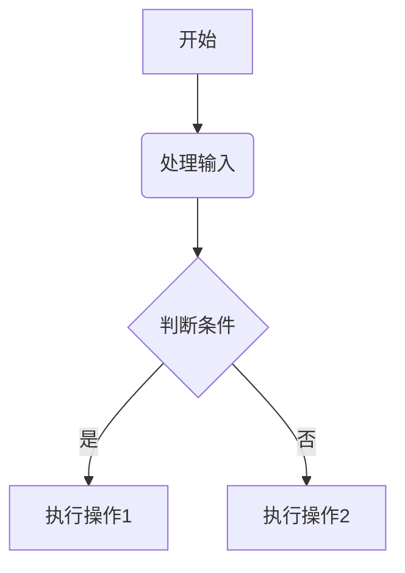
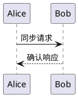

# About 画图
 # 画图

## 支持的绘图方式

### 1. Mermaid 流程图


### 2. PlantUML 时序图


### 3. LaTeX 数学图形

```LaTeX
\begin{tikzpicture}
    \draw (0,0) circle (1cm);
    \draw[->] (0,0) -- (1,1);
\end{tikzpicture}
```


### 4. SVG 矢量图嵌入
```svg
<svg width="100" height="100">
    <circle cx="50" cy="50" r="40" stroke="black" fill="red"/>
</svg>
```


### 5. 代码块图形


